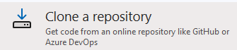

# Test CMake project for C++ Courses

This is a simple CMake project to test the CMake configuration for the C++ courses.

This project can be found on [github](https://github.com/chuckmccullough85/CppInstallTest).

## Prerequisites
-- CMake 3.20 or higher - [Download](https://cmake.org/download/)
-- C++ Compiler (GCC, Clang, MSVC, etc.)  - Make sure the compiler is C++ 20 compliant or higher.
    Here are the versions of the compilers that support C++ 20:
    - GCC 10 or higher
    - Clang 10 or higher
    - MSVC 19.24 or higher

-- IDE of your choice
    - Visual Studio 2022 or higher - download from [here](https://visualstudio.microsoft.com/downloads/)
        - Make sure to install the C++ Desktop Development workload
    - Visual Studio Code - download from [here](https://code.visualstudio.com/download)
        - Make sure to install the C++ extension from Microsoft
        - Make sure to install the CMake Tools extension from Microsoft

## Testing your installation

### Visual Studio 2022
1. Start Visual Studio 2022
2. If you want to clone the test project, choose *Clone a repository* and paste the URL of this repository.  

3. If you downloaded the project as a zip file, unzip it and choose *Open a local folder* 

    - open the folder containing *CMakeLists.txt* file and the subfolders *Console* and *GoogleTest*

4. Immediately upon opening the folder, Visual Studio will start configuring the project. You will see the progress in the status bar at the bottom of the window.  When it displays `CMake generation finished`, you can run the tests.

5. Run Console test - first choose *Console.exe* from the dropdown list and then click the green arrow to run the test.  

    - The console project will open a console window and display the message `Hello, World!`.  If you see this message, the test passed.

7. Run GoogleTest - first choose *GoogleTest.exe* from the dropdown list and then click the green arrow to run the test.
    - The google test project will show an output that 3 tests passed.  If you see this message, the test passed.

See *Troubleshooting* below for common issues if the build fails.

### Visual Studio Code

> Note:  Microsoft provides a good tutorial on installing and configuring Visual Studio Code for C++ development.  You can find it [here](https://code.visualstudio.com/docs/cpp/introvideos-cpp).  The subtopics on the left side of the page provide more detailed information on setting up the C++ development environment on different platforms.

1. Start Visual Studio Code
2. If you want to clone the test project, choose *Clone Repository* and paste the URL of this repository.
3. If you downloaded the project as a zip file, unzip it and choose *Open Folder* and open the folder containing *CMakeLists.txt* file and the subfolders *Console* and *GoogleTest*
4. If you have not installed the C++ extension and the CMake Tools extension, you will be prompted to install them.  Follow the prompts to install the extensions.
5. VS Code will prompt to choose a kit for the project.  Choose the kit that matches your compiler. 

    - if it did not prompt, press `Ctrl+Shift+P` and type `CMake: Select a Kit` and choose the kit that matches your compiler.  
    - you may need to restart VS Code if you installed tools after opening the project.
6. In the *CMake* tab, find the *Console* project and right-click *Run in Terminal* to build and run the project.  The console project will open a console window and display the message `Hello, World!`.  If you see this message, the test passed.

7. In the *CMake* tab, find the *GoogleTest* project and right-click, choose *Run in Terminal* to build and run the project.  The google test project will show an output that 3 tests passed.  If you see this message, the test passed.

---

*Troubleshooting*: If you see any errors, check the output window for the error messages.  

The most common issue is network blocking access to github and the google test project.  If that is the case, check with your IT support to allow access or find an alternative location to download the google test project.

